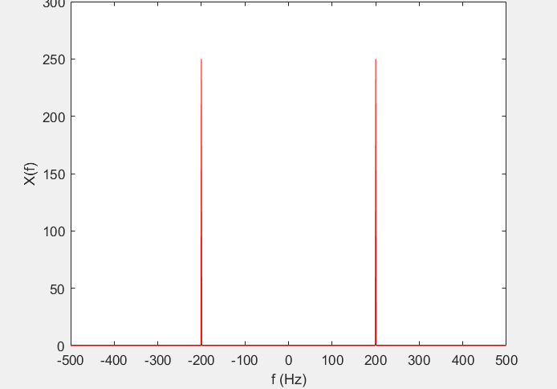
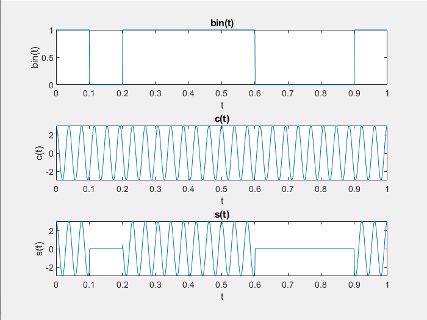
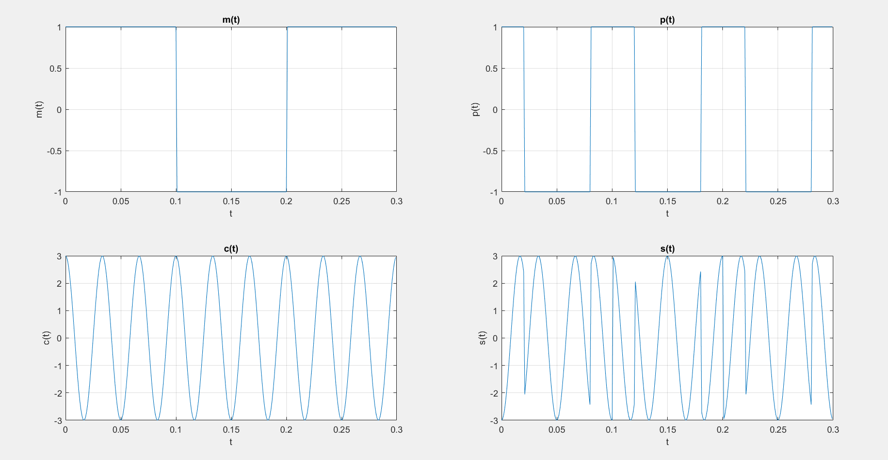
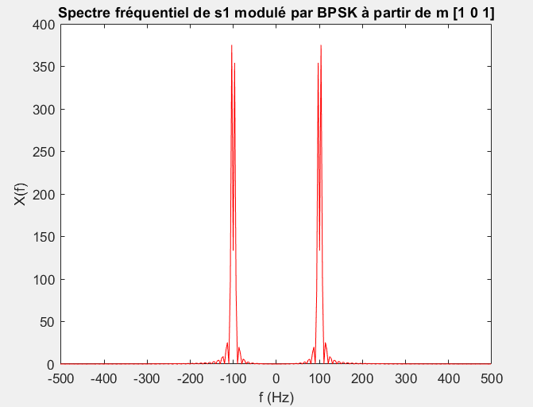
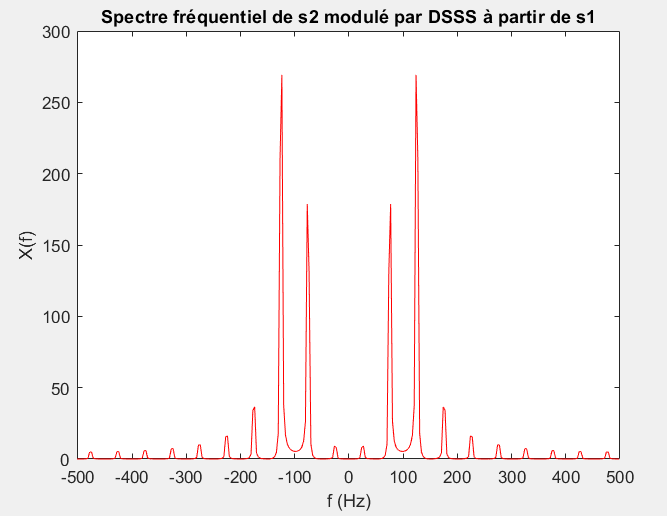
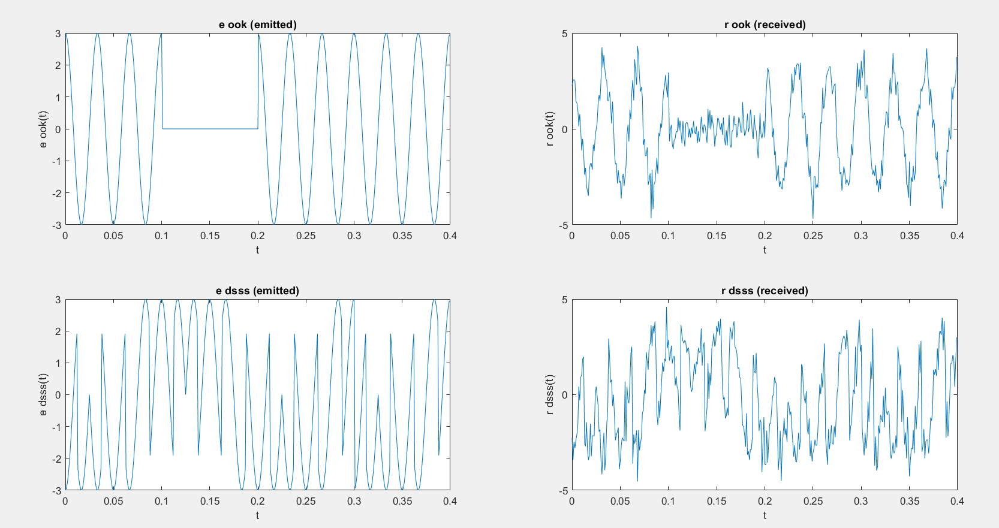
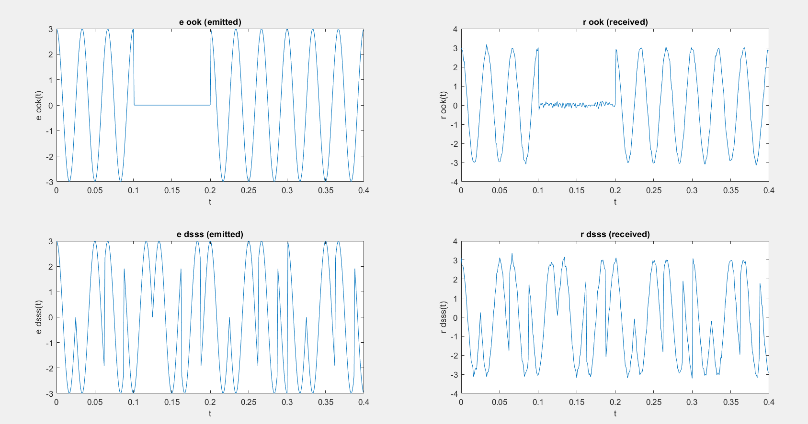

# Rapport du Mini Projet de FOM, par GUEGANNO Gabriel et KHA Alexandre

Le principal but de ce sujet est la modélisation sous MATLAB d'une simple chaîne de transmission numérique, en se basant sur des formes d'ondes et modulations numériques récentes. 
Il nous permet d'expliquer des notions simples mais essentielles en communication numérique. Les parties sur les codages source et canal ne seront pas considérées ici (le codage canal ou codage source seront développées ultérieurement dans le module traitement et protection de l'information).
Le canal de transmission est considéré comme un canal idéal avec un bruit additif blanc gaussien (AWGN : Additive White Gaussian Noise). Dans ce cas, la non linéarité , la sélectivité fréquentielle et les multi-trajets du canal seront négligés. Ainsi l'interférence entre symboles n'est pas considérée. Donc on suppose que le débit respecte le critère de Nyquist-Shannon et un filtre de mise en forme ne sera pas nécessaire.
La synchronisation entre l'émetteur et le récepteur est supposée parfaite. Finalement, le simple cas d'un seul émetteur-récepteur est considéré, le multiplexage ne sera pas pris en considération.

## Affichage et analyse spectrale
1. Il n'y a rien à signaler dans cette question qui ne consiste qu'à implémenter un plot dans des fonctions.
On notera que TraceTI prend en argument un vecteur des temps t et un signal x dépendant de t, et trace x(t). On a considéré que le vecteur des temps était déjà échantillonné selon une fréquence d'échantillonnage Fs.
TraceFFT prend en arguments également un vecteur des temps t et un  un signal x. On fait bien attention à utiliser fftshift et non pas fft pour centrer le spectre fréquentiel (on fait ici le choix de représenter la Densité Spectrale de Puissance) en 0.

    Figure 1 : Spectre temporel de cos(2*pi*200*t)

    Figure 2 : DSP de cos(2*pi*200*t)
    
## Message
2. Nous souhaitons créer un message aléatoire contenant des bits binaires par le biais d'une fonction rbin(n), qui prend en argument le nombre de bits contenus. Avec randn, on génère un vecteur ligne de n colonnes de réels aléatoires suivant une loi normale. On transforme chaque nombre en booléen (0 ou 1) suivant s'ils sont positifs ou non. Par exemple:
rbin(5) peut générer randn(5) =  2.67 -1.56 -2.3 1.57  2.34  qui sera transformée en  1 0 0 1 1

## Modulation
3. 
 

    Figure 3 : Résultat d'une modulation OOK avec le message binaire transformée en signal rectangle bin(t) sur le subplot 1, la porteuse c(t) en sublot 2 et le signal modulé s(t) en subplot 3

4. La modulation DSSS (par étalement de bande passante) consiste à multiplier un signal message m(t) par un code pseudo-aléatoire p(t) possédant un plus grand "chip rate" (fréquence de chips ou de pulsations) que la fréquence des bits du message. Le signal modulé peut être écrit s(t) = m(t)*p(t).

        Figure 4 : Illustration de la modulation DSSS. Ici on notera qu'une période de bit Tb correspond à 5 périodes de chip Tc. 
        
Une technique de démodulation consiste à multiplier le signal modulé par le même code pseudo-aléatoire. En pratique, du bruit i(t) s'est ajouté à s(t) tel que s(t) = m(t)*p(t) + i(t).
La démodulation produit le signal reçu r(t) = m(t) + i(t)*p(t), le 2e terme étant à l'évidence gênant. Mais plus le "chip rate" du pseudo code est élevé, plus la densité spectrale du bruit est étalée et de moins grande valeur, ce qui permet de distinguer clairement le message.
Les avantages de la modulation DSSS sont une forte sécurité du signal modulé ainsi qu'une immunité au jamming (brouillage intentionnel du signal).En contrepartie la modulation DSSS peut être lente et elle nécessite que le générateur de pseudo-bruit génère des séquences de haute fréquence. 
Cette modulation possède des applications en CDMA (accès multiple par répartition en code) qui est une norme de réseau permettant à plusieurs liaisons d'utiliser la même fréquence porteuse. Elle permet notamment un accès à un internet haut débit et est utilisée dans les systèmes GNSS.
On peut voir les spectres temporels et fréquentiels de la modulation sur les graphes ci-dessous :

        Figure 5 : Comparaison entre le message m (1 0 1) de période 0.1, le code pseudo-aléatoire (0 1 1 0 1) de période 0.02  et le signal modulé s
        

        Figure 6 : DSP du message m (1 0 1) de période 0.1
        

        Figure 7 : DSP du signal s modulé à partir de m
        
 Cette modulation d'étalement de spectre porte bien son nom puisque le signal modulé occupe une plus large bande passante, tout en perdant en amplitude, donnant l'impression que le spectre "'s'aplatit".
 
 ## Canal de transmission
 
 5. On modélise le canal de transmission idéal avec Bruit Additif Blanc Gaussien par une fonction channel prenant en argument un signal émis (à priori déjà modulé).
 La fonction channel renvoie en sortie ce signal auquel on ajoute un bruit blanc (par le biais d'awgn), et on notera ue l'on a choisi en première approche un SNR de 25dB qui témoigne d'un canal robuste au bruit et donc d'une bonne transmission, mais c'et un paramètre qu'il est possible de modifier.
 
 
 
        Figure 9 : Les subplots de gauche sont les signaux émis e(t) (par modulation OOK et DSSS) et ceux de droite les signaux reçus r(t) après passage par le canal (SNR = 10)
        

        Figure 10 : Même figure que la précédente mais avec SNR = 25

